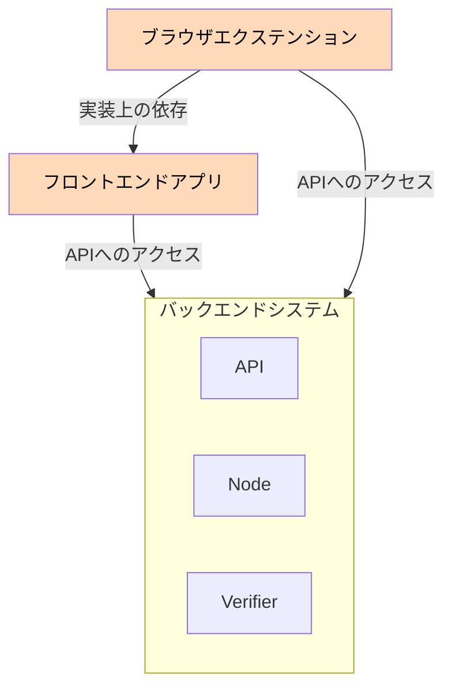
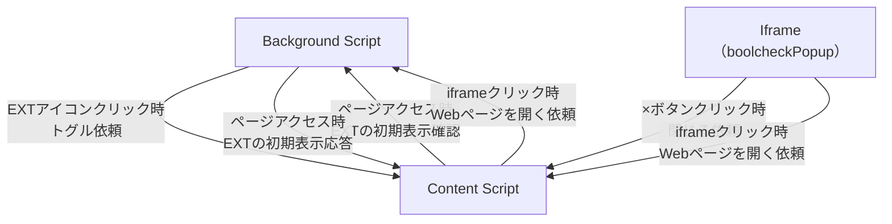

# boolcheck-frontend

- 偽・誤情報対策のための真偽表明プラットフォーム、 [Boolcheck](https://app.boolcheck.com/) のフロントエンドアプリを管理するリポジトリです。
- [バックエンド側のシステム](https://github.com/datasign-inc/Boolcheck-Back-End) と連携して動作することを想定しています。

## 本リポジトリの内容と構成の概要

本リポジトリは、 [フロンドエンドアプリ](https://app.boolcheck.com/) と [ブラウザエクステンション](https://chromewebstore.google.com/detail/boolcheck/mfpglnkonkalkcpmoghbogjcefflohce) の2つの実装を含みます。



## 前提

- Node.js v20.13.1
- yarn 1.22.22

## ビルド

### フロントエンドアプリ

`.env` ファイルをプロジェクト直下に作成し以下変数に対して値を設定してください。

| 変数名                        | 説明                        |
|------------------------------|---------------------------|
| `VITE_APP_URL`               | フロントエンドアプリケーションのURL       |
| `VITE_BACKEND_API_URL`       | バックエンドAPIのエンドポイント         |
| `VITE_BACKEND_VERIFIER_URL`  | バックエンドVerifierサービスのエンドポイント |
| `VITE_BACKEND_NODE_URL`      | バックエンドノードサービスのエンドポイント     |

その後、以下のコマンドを実行してください。

```shell
yarn install
yarn build
ls dist
```

### エクステンション

`extension/.env` ファイルを作成し、上述したフロントエンドアプリの環境変数と同じものを設定してください。
その後、以下のコマンドを実行してください。

```shell
cd extension
yarn install
yarn build
ls dist
```

## 開発

### フロントエンドアプリ

- `yarn dev`コマンドにて、ローカル開発サーバーが起動します。この時アプリに表示されるデータは、`src/api/mock/data/` 下のJSONです。
- `yarn storybook`コマンドにて、storybookのローカル開発サーバーが起動します。
- `yarn test`コマンドにて、テストを実行します。

### エクステンション

#### 動作の確認

- `yarn build`コマンドによって、`extension/dist`が生成されます。
- Google Chromeを開き、 `chrome://extensions/` にアクセスします。
- 「パッケージ化されていない拡張機能を読み込む」をクリックし、 `extension/dist` ディレクトリを読み込むことで、ブラウザ上での動作確認が可能です。

#### エクステンションの構成



大きく3つの要素から構成されます。
- バックグラウンドスクリプト
    - エクステンションアイコンのクリックを検知し、コンテンツスクリプトに通知します
    - 新たなタブでWebサイトのURLを開きます。(ポップアップから、コンテンツスクリプトを経由して依頼を受信します)
- コンテンツスクリプト
    - ポップアップの表示、非表示の制御を行います。
- ポップアップ(iframe)
    - Reactによるポップアップ画面を表示するものです。
    - 閉じるボタンの押下や、Webサイトを開く機能が実行された場合、その情報をコンテンツスクリプトにiframeのメッセージとして送信します。